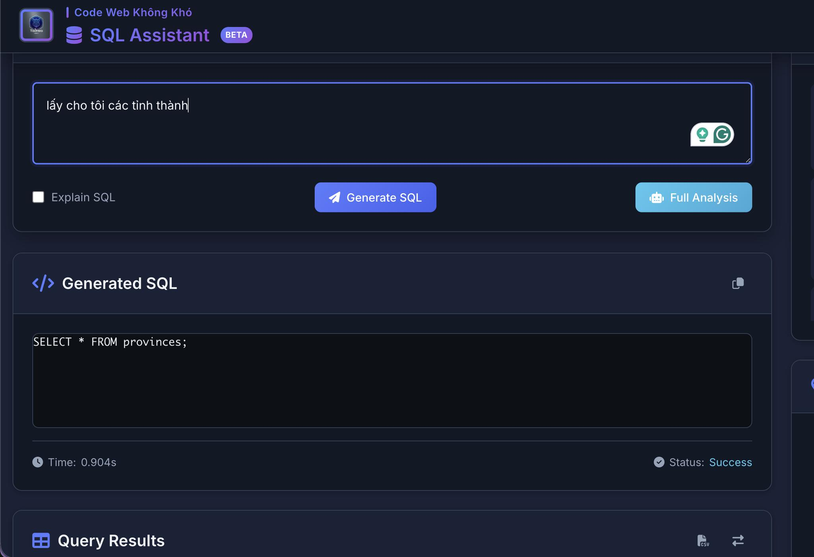
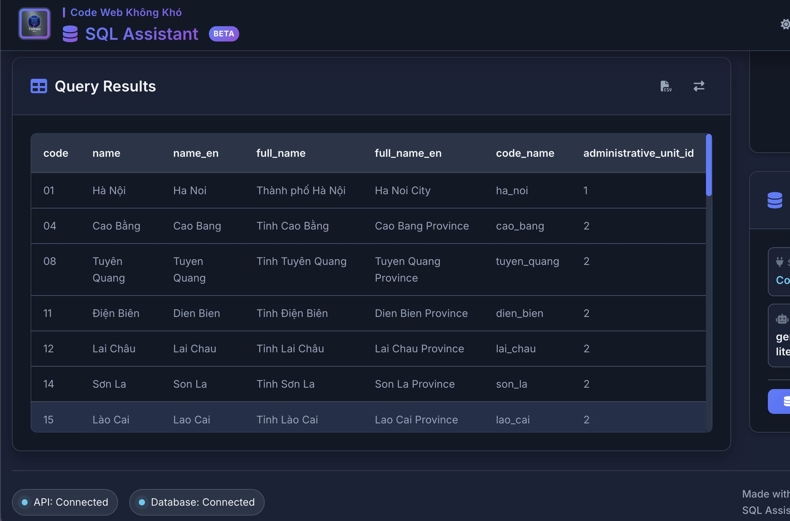
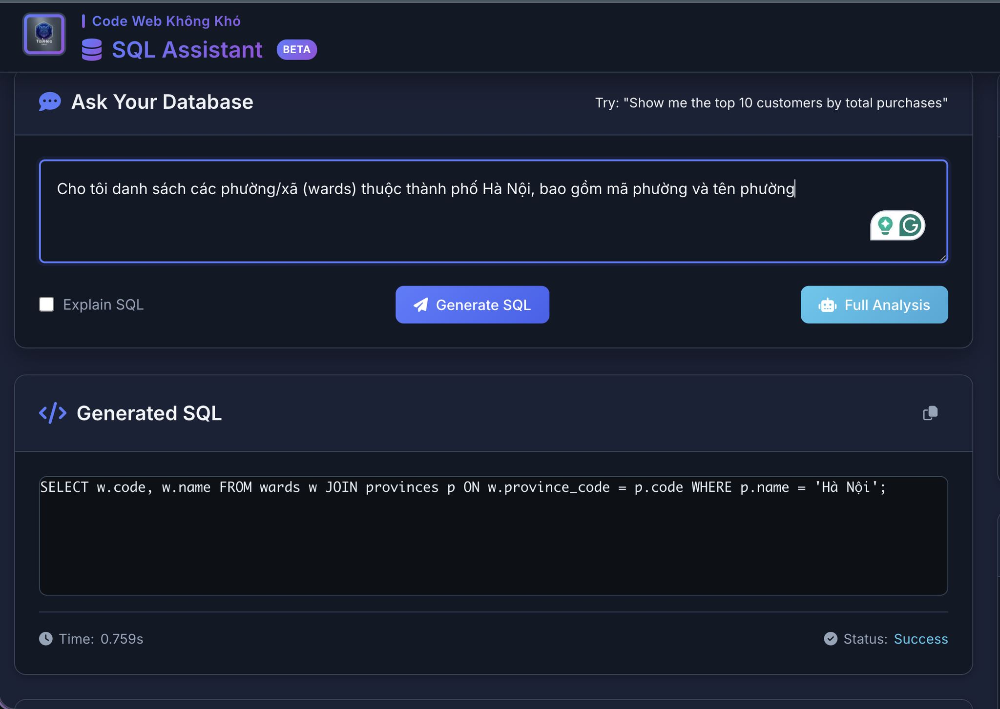
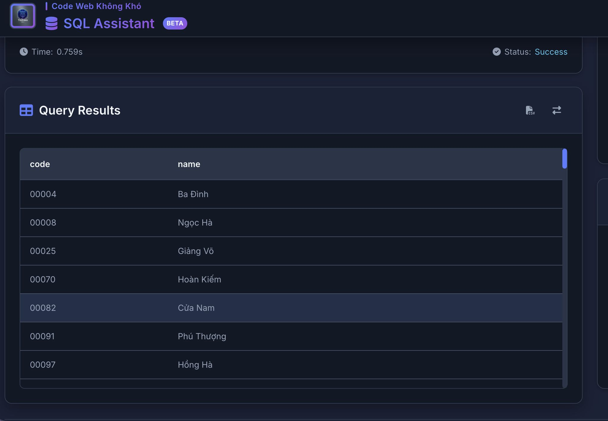

# Code Web Không Khó – AI SQL Assistant 🤖

<p align="center">
  
</p>

<p align="center">
  
  
</p>

<p align="center">
  
  
</p>


## Giới thiệu

Đây là một **AI SQL Assistant** đơn giản nhưng thực tế, cho phép người dùng **đặt câu hỏi bằng ngôn ngữ tự nhiên** và hệ thống sẽ tự động:

- Hiểu câu hỏi
- Phân tích cấu trúc database
- Sinh câu lệnh **SQL SELECT**
- Thực thi trực tiếp trên PostgreSQL
- Trả về kết quả dạng JSON cho frontend

Dự án phù hợp để:
- Demo AI + Database
- Giảng dạy SQL / Backend
- Làm nền cho chatbot dữ liệu, dashboard, internal tool

> Hệ thống đang sử dụng **AI của Gemini**, nhưng phần này được trừu tượng hoá để người đọc tập trung vào luồng xử lý, không phụ thuộc model.

---

## Kiến trúc tổng quan

```
Người dùng
   ↓ (Câu hỏi tự nhiên)
Frontend (HTML / JS)
   ↓
FastAPI Backend
   ↓
AI (hiểu câu hỏi → sinh SQL)
   ↓
PostgreSQL Database
   ↓
Kết quả JSON
```

---

## Công nghệ sử dụng

- **Backend**: Python, FastAPI
- **Database**: PostgreSQL
- **ORM / Query**: SQLAlchemy
- **AI**: Gemini (ngôn ngữ tự nhiên → SQL)
- **Frontend**: HTML, CSS, JavaScript (fetch API)
- **Container**: Docker, Docker Compose

---

## Tính năng chính

- Đặt câu hỏi bằng tiếng Việt / tiếng Anh
- Tự động đọc schema database
- Chỉ cho phép truy vấn **SELECT** (an toàn)
- Tự làm sạch SQL do AI sinh ra
- Health check & schema endpoint
- Dễ mở rộng sang chatbot, dashboard, hoặc API service

---

## Cấu trúc thư mục

```
app/
├── main.py              # FastAPI app, middleware, lifespan
├── config.py            # Env, logging, global variables
├── database.py          # Database engine & schema logic
├── ai.py                # Gemini AI logic (generate SQL)
├── utils.py             # Helper functions (clean SQL)
├── schemas.py           # Pydantic models
├── routes.py            # API endpoints
└── __init__.py
```

---

## Cách chạy dự án

### 1️⃣ Yêu cầu
- Docker
- Docker Compose

### 2️⃣ Khởi động hệ thống

```bash
docker compose up --build
```

Sau khi chạy xong:
- Backend: http://localhost:8000
- Frontend: mở trực tiếp `index.html` hoặc serve qua web server

---

## Các API chính

### Health check
```
GET /api/health
```

### Lấy schema database
```
GET /api/schema
```

### Đặt câu hỏi SQL
```
POST /api/query
```

Body:
```json
{
  "question": "Liệt kê 10 khách hàng mua nhiều đơn hàng nhất"
}
```

Response:
```json
{
  "sql_query": "SELECT ...",
  "result": [...],
  "execution_time": 0.23,
  "success": true
}
```

---

## Ý tưởng mở rộng

- Phân quyền user (read-only / admin)
- Lưu lịch sử câu hỏi & SQL
- Streaming kết quả
- Kết hợp biểu đồ (Chart.js)
- Kết nối với dashboard nội bộ
- Dùng làm nền cho chatbot dữ liệu doanh nghiệp

---

## Lưu ý

- Dự án **không public cấu hình nhạy cảm**
- Người đọc cần tự cấu hình biến môi trường khi triển khai
- Mục tiêu chính là **demo luồng AI + SQL**, không phải sản phẩm thương mại hoàn chỉnh

---

## Tác giả

**TàiHeo Dev**  
Xây dựng & chia sẻ các dự án Backend – AI – Database  
📌 Phù hợp cho học tập, demo và giảng dạy

---

> “Không cần biết SQL giỏi đến đâu, chỉ cần biết hỏi đúng câu hỏi.”

---

## 💖 Donate Ủng Hộ

Nếu bạn thấy các source hữu ích và muốn mình tiếp tục phát triển nội dung miễn phí, hãy ủng hộ mình bằng cách donate.  
Mình sẽ sử dụng kinh phí cho:

- 🌐 Server, domain, hosting
- 🛠️ Công cụ bản quyền (IDE, plugin…)
- 🎓 Học bổng, quà tặng cho cộng đồng

### QR Code Ngân Hàng

Quét QR để ủng hộ nhanh:


**QR Code ABBank**  
- Chủ tài khoản: Nguyễn Tiến Tài  
- Ngân hàng: NGAN HANG TMCP AN BINH  
- Số tài khoản: 1651002972052

---

## 📞 Liên Hệ

- 🎥 TikTok Source: [@hoclaptrinhvui](https://www.tiktok.com/@hoclaptrinhvui)
- 📚 Tiktok Dạy Học: [@code.web.khng.kh](https://www.tiktok.com/@code.web.khng.kh)
- 💻 GitHub: [fdhhhdjd](https://github.com/fdhhhdjd)
- 📧 Email: [nguyentientai10@gmail.com](mailto:nguyentientai10@gmail.com)

Cảm ơn bạn đã quan tâm & chúc bạn học tập hiệu quả! Have a nice day <3!!
